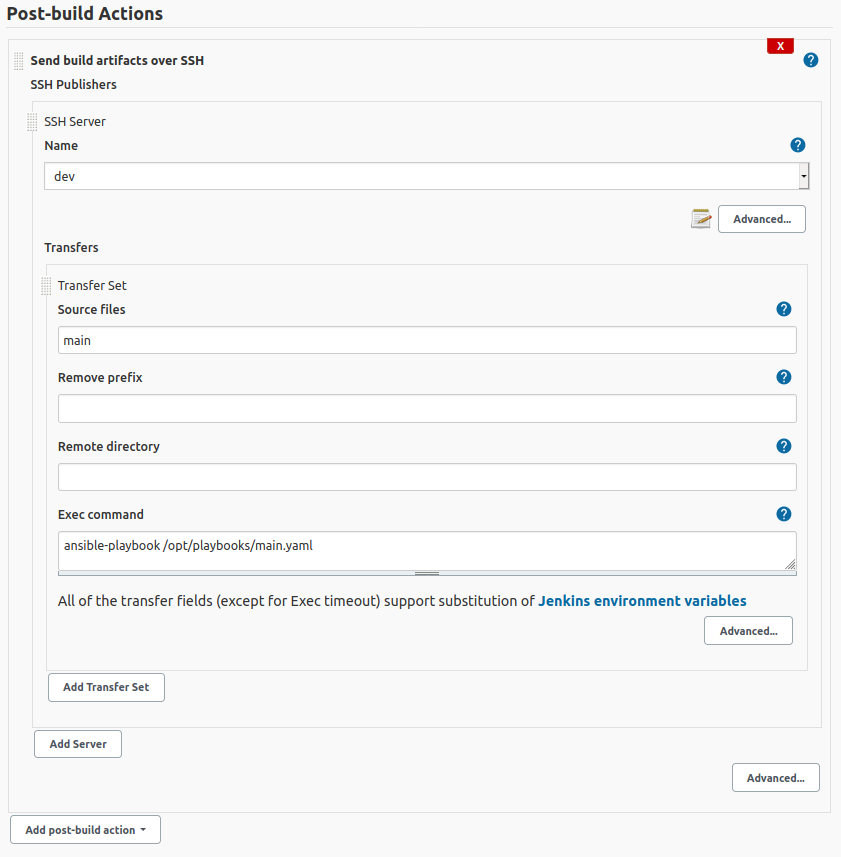
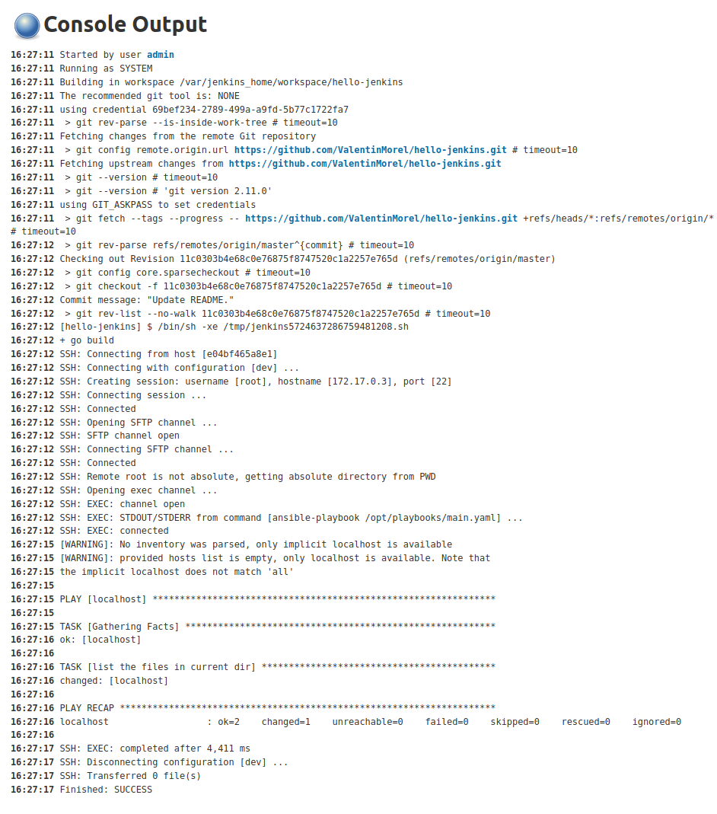

# CI/CD Automation : Ansible and Jenkins


## How Ansible works 


Assuming a RSA key is already created; The SSH access between master and slaves is granted with the command : 
```sh
ssh-copy-id -i ~/.ssh/<public_key_file> <user>@<remote machine>
```

ssh-copy-id moves the public key file specified with _-i ~/.ssh/<public_key_file>_ from your computer to _<remote machine>_. It will be stored in the file _~/.ssh/authorized_keys_ in the directory of _<user>_.
_<user>_ should be the user you are attempting to login to _<remote machine>_ with.
If you only have one public key file in your local _~/.ssh_ directory, you can omit the _-i ~/.ssh/<public_key_file>_ option. This is really only necessary if you have multiple public keys, because ssh-copy-id needs to know which key you want to move.


## Configuration


## Output



> Note : This work is based on DevOps Project 1 for the basics config.